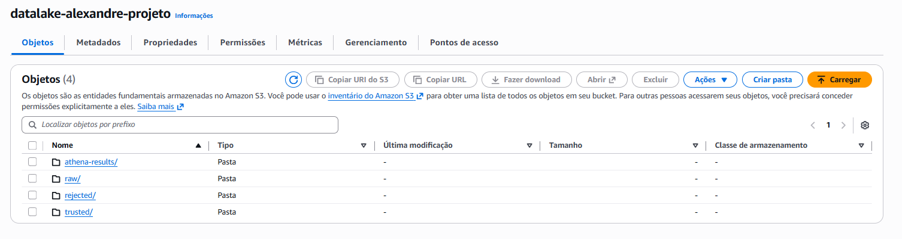
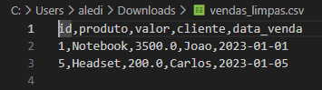

# Pipeline ETL e Qualidade de Dados na AWS (Pandas + Boto3) 🛡️

## 🎯 O Problema de Negócio
Em projetos de migração de dados, é comum receber arquivos de **sistemas legados** contendo inconsistências críticas (datas inválidas, valores negativos, chaves primárias nulas). Ingerir esses dados diretamente em bancos de produção ou dashboards gera métricas erradas e desconfiança na área de dados.

## 💡 A Solução
Desenvolvi um script de engenharia de dados (ETL) que atua como um "Firewall de Qualidade". Ele lê os dados brutos do Data Lake (S3), aplica regras de validação rígidas e separa os registros automaticamente em camadas, garantindo que apenas dados confiáveis cheguem à etapa final.

## 🛠️ Tecnologias Utilizadas
* **Linguagem:** Python 3.11
* **Engenharia de Dados:** Pandas (Manipulação de DataFrames)
* **Cloud & Orquestração:** AWS SDK (Boto3)
* **Armazenamento:** Amazon S3
* **Arquitetura:** Medallion Architecture Simplificada (Bronze/Raw → Silver/Trusted)

## ⚙️ Regras de Validação Implementadas
O pipeline verifica cada linha do dataset contra as seguintes regras de negócio:
1.  **Sanidade de IDs:** Registros sem identificador único (ID) são rejeitados.
2.  **Consistência Financeira:** O valor da venda deve ser numérico e maior que zero (Revenue Integrity).
3.  **Validação Temporal:** Datas devem seguir formato válido (YYYY-MM-DD); registros com datas corrompidas ou inexistentes são descartados.

## 📸 Resultados do Processamento

### 1. Arquitetura de Pastas (Separação Automática)
O script criou automaticamente a estrutura no S3 para segregar os dados baseado na qualidade:
* `raw/`: Entrada bruta (com erros).
* `trusted/`: Dados higienizados e aprovados.
* `rejected/`: Dados reprovados (Quarentena para auditoria).



### 2. Dados Limpos (Camada Trusted)
Abaixo, o resultado final do processamento. O script removeu corretamente as linhas com datas inválidas e valores negativos, restando apenas os dados consistentes (Notebook, Headset):



## 🚀 Como Executar
1. Clone este repositório.
2. Configure as credenciais AWS no script `etl_qualidade.py` (ou via variáveis de ambiente).
3. Garanta que o arquivo `vendas_sujas.csv` esteja na pasta `raw/` do bucket S3 alvo.
4. Instale as dependências:
   ```bash
   pip install pandas boto3
